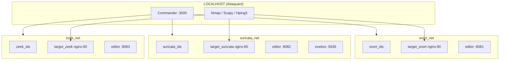

# Rust.Nmap.Network - IDS Lab Commander

[](https://www.rust-lang.org/)
[](https://www.docker.com/)
[](https://nmap.org/)
[](https://www.snort.org/)
[](https://suricata.io/)
[](https://zeek.org/)
[](https://www.python.org/)
[](https://scapy.net/)

Laboratoire académique de test d'évasion IDS avec interface de pilotage complète.

## Architecture



## Quick Start

### 1. Configuration initiale (une seule fois)

```bash
# Ajouter l'utilisateur au groupe docker
sudo usermod -aG docker $USER
newgrp docker

# Vérifier
docker ps  # Doit fonctionner sans sudo
```

### 2. Démarrer les labs

```bash
# Tous les labs
./scripts/start_all_labs.sh

# Ou un seul lab
cd suricata-lab && docker compose up -d
```

### 3. Démarrer le Commander

```bash
cd commander
cargo run
```

### 4. Ouvrir le dashboard

http://localhost:3000

## Interfaces Web

| Port | Service | Description |
|------|---------|-------------|
| 3000 | Commander | Dashboard principal, templates, cookbook |
| 5636 | EveBox | Visualisation alertes Suricata |
| 8081 | Filebrowser | Édition règles Snort |
| 8082 | Filebrowser | Édition règles Suricata |
| 8083 | Filebrowser | Édition scripts Zeek |

## Niveaux de Sécurité

Le dashboard permet de basculer entre 5 niveaux de règles pour chaque IDS:

| Niveau | Nom | Description |
|--------|-----|-------------|
| 1 | Minimal | Très perméable, détecte uniquement les attaques évidentes |
| 2 | Basic | Détecte les scans courants (SYN, NULL, XMAS) |
| 3 | Moderate | Équilibré, idéal pour tester l'évasion |
| 4 | Strict | Haute sensibilité, détecte la fragmentation |
| 5 | Paranoid | Sécurité maximum, alerte sur presque tout |

## Scripts d'attaque

```bash
# Test rapide d'un lab
./scripts/quick_test.sh suricata

# Test de tous les niveaux
./scripts/scan_all_levels.sh suricata

# Attaque par fragmentation (Scapy)
sudo python3 ./scripts/fragment_attack.py 172.19.0.3
```

## Techniques d'évasion testables

### Fragmentation IP
```bash
sudo nmap -f TARGET_IP              # Fragmentation simple
sudo nmap -f -f --mtu 8 TARGET_IP   # Fragmentation max
```

### Timing
```bash
sudo nmap -T0 TARGET_IP   # Très lent (évite seuils)
sudo nmap -T1 TARGET_IP   # Lent
```

### Decoys
```bash
sudo nmap -D RND:10 TARGET_IP       # 10 decoys aléatoires
sudo nmap -D decoy1,decoy2 TARGET   # Decoys spécifiques
```

### Source port
```bash
sudo nmap --source-port 53 TARGET_IP   # Port DNS (souvent autorisé)
sudo nmap --source-port 80 TARGET_IP   # Port HTTP
```

## Structure du projet

```
Rust.Nmap.Network/
├── commander/
│   ├── Cargo.toml
│   ├── src/main.rs
│   └── templates/          # 5 niveaux x 3 IDS
│       ├── snort/
│       ├── suricata/
│       └── zeek/
├── snort-lab/
│   ├── docker-compose.yml
│   └── config/
├── suricata-lab/
│   ├── docker-compose.yml
│   ├── rules/
│   └── logs/
├── zeek-lab/
│   ├── docker-compose.yml
│   └── scripts/
├── scripts/                # Scripts d'attaque
│   ├── start_all_labs.sh
│   ├── stop_all_labs.sh
│   ├── quick_test.sh
│   ├── scan_all_levels.sh
│   └── fragment_attack.py
└── README.md
```

## Workflow académique suggéré

1. **Comprendre**: Lire les règles au niveau 3 (Moderate)
2. **Tester**: Lancer un scan nmap standard, observer les alertes
3. **Analyser**: Identifier quelle règle a déclenché l'alerte
4. **Évader**: Tester des techniques (fragmentation, timing, decoys)
5. **Comparer**: Passer au niveau 4, retester les mêmes techniques
6. **Documenter**: Noter quelles techniques évitent quels niveaux

## Troubleshooting

### Docker sans sudo
```bash
sudo usermod -aG docker $USER
newgrp docker
```

### Règles ne se rechargent pas
```bash
# Forcer manuellement
docker kill -s SIGHUP snort_ids
docker kill -s USR2 suricata_ids
docker restart zeek_ids
```

### Container ne démarre pas
```bash
docker logs snort_ids
docker logs suricata_ids
```

## Liens utiles

- [Nmap Reference Guide](https://nmap.org/book/man.html)
- [Snort 3 Rules](https://docs.snort.org/rules/)
- [Suricata Rules](https://docs.suricata.io/en/latest/rules/)
- [Zeek Scripts](https://docs.zeek.org/en/master/scripting/)
