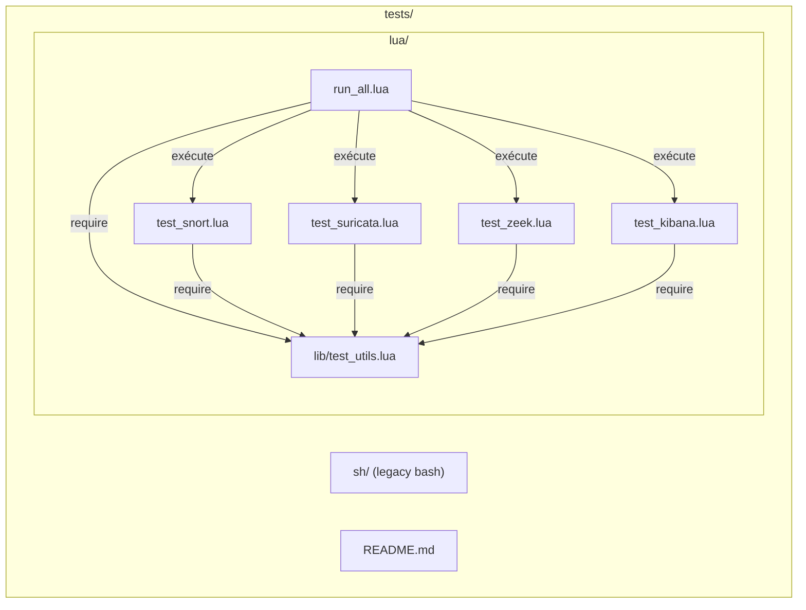
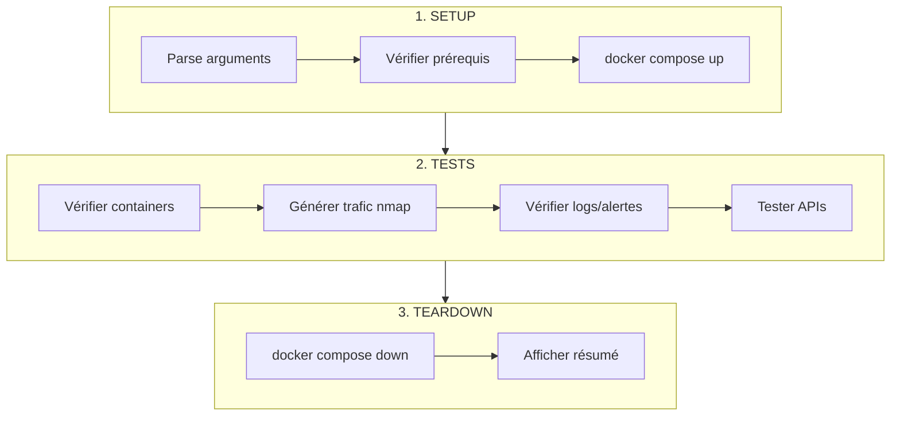
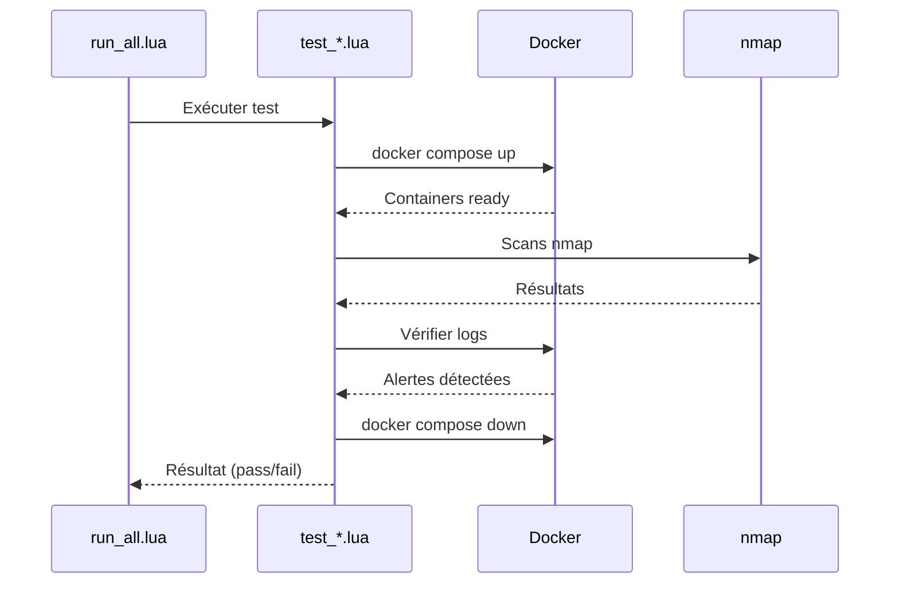

# Tests IDS Lab

Ce document décrit le framework de tests Lua pour les labs IDS.

## Stack Technique

### Lua 5.3

Les tests utilisent **Lua 5.3** pour sa légèreté et sa simplicité.

```bash
# Installation
sudo apt install lua5.3

# Vérification
lua5.3 --version
```

### Pourquoi Lua ?

| Avantage | Description |
|----------|-------------|
| **Léger** | ~300KB, pas de dépendances lourdes |
| **Rapide** | Interpréteur performant |
| **Portable** | Fonctionne sur Linux, macOS, Windows |
| **Intégré** | Déjà utilisé par Snort (config Lua) |
| **Simple** | Syntaxe claire, facile à maintenir |

## Architecture



### Fichiers

| Fichier | Description |
|---------|-------------|
| `lib/test_utils.lua` | Framework (assertions, HTTP, Docker) |
| `run_all.lua` | Runner principal |
| `test_snort.lua` | Test Snort Lab |
| `test_suricata.lua` | Test Suricata Lab |
| `test_zeek.lua` | Test Zeek Lab |
| `test_kibana.lua` | Test Kibana Lab (ELK) |

## Framework test_utils.lua

Le module `test_utils.lua` fournit les utilitaires communs :

### Logging

```lua
local T = require("test_utils")

T.log_info("Message d'information")     -- [INFO] bleu
T.log_success("Test passé")             -- [PASS] vert
T.log_error("Test échoué")              -- [FAIL] rouge
T.log_warning("Avertissement")          -- [WARN] jaune
T.log_section("=== Section ===")        -- Titre cyan
```

### Assertions

```lua
-- Vérifie une condition
T.assert_true(condition, "Message succès", "Message échec")

-- Vérifie qu'une valeur n'est pas nil
T.assert_not_nil(value, "Description")

-- Vérifie l'égalité
T.assert_equals(actual, expected, "Description")

-- Vérifie qu'une chaîne contient un pattern
T.assert_contains(str, "pattern", "Description")

-- Vérifie qu'un nombre est supérieur
T.assert_greater(count, 0, "Au moins un élément")

-- Warning (ne fait pas échouer le test)
T.warn("Message d'avertissement")
```

### Exécution de commandes

```lua
-- Exécuter une commande et récupérer la sortie
local output, exit_code = T.run("docker ps")

-- Vérifier si une commande réussit
if T.run_ok("docker --version") then
    print("Docker installé")
end
```

### HTTP

```lua
-- Requête GET
local body, status = T.http_get("http://localhost:9200", 10)

-- Vérifier si une URL est accessible
if T.http_ok("http://localhost:5601") then
    print("Kibana accessible")
end

-- Extraire une valeur JSON
local cluster = T.json_extract(body, "cluster_name")
```

### Docker

```lua
-- Vérifier si un container est running
if T.docker_running("suricata_ids") then
    print("Suricata actif")
end

-- Démarrer un lab
T.docker_compose_up("/path/to/lab")

-- Arrêter un lab
T.docker_compose_down("/path/to/lab")

-- Exécuter une commande dans un container
local output, ok = T.docker_run("snort_ids", "cat /var/log/snort/alert.txt")
```

### Utilitaires

```lua
-- Attendre N secondes
T.sleep(5)

-- Attendre qu'une condition soit vraie (avec timeout)
local ready = T.wait_for(function()
    return T.http_ok("http://localhost:9200")
end, 60, 2, "Attente Elasticsearch")

-- Chemin du projet
local root = T.get_project_root(arg[0])

-- Compter les lignes d'un fichier
local count = T.count_lines("/path/to/file.log")

-- Compter les entrées JSON
local json_count = T.count_json_lines("/path/to/eve.json")
```

### Résultats

```lua
-- Réinitialiser les compteurs
T.reset_results()

-- Afficher le résumé et récupérer le status
local all_passed = T.print_summary()

-- Récupérer les résultats
local results = T.get_results()
print(results.passed, results.failed, results.warnings)
```

## Exécution des Tests

### Tous les tests

```bash
cd tests/lua
lua5.3 run_all.lua
```

### Test individuel

```bash
lua5.3 test_snort.lua
lua5.3 test_suricata.lua
lua5.3 test_zeek.lua
lua5.3 test_kibana.lua
```

### Options de ligne de commande

| Option | Description |
|--------|-------------|
| `--no-start` | Ne pas démarrer le lab (utiliser un lab déjà running) |
| `--no-stop` | Ne pas arrêter le lab après les tests |
| `--quick` | Tests rapides (skip certains scans lents) |
| `-h, --help` | Afficher l'aide |

```bash
# Tester un lab déjà démarré
lua5.3 test_suricata.lua --no-start --no-stop

# Test rapide
lua5.3 run_all.lua --quick

# Tests spécifiques
lua5.3 run_all.lua snort suricata
```

## Structure d'un Test

```lua
#!/usr/bin/env lua5.3
-- =============================================================================
-- TEST EXAMPLE LAB
-- =============================================================================

package.path = package.path .. ";./lib/?.lua"
local T = require("test_utils")

-- Configuration
local CONFIG = {
    target_ip = "172.29.0.100",
    container_ids = "example_ids",
}

local OPTIONS = {
    no_start = false,
    no_stop = false,
}

-- Parse arguments
local function parse_args()
    for i = 1, #arg do
        if arg[i] == "--no-start" then OPTIONS.no_start = true
        elseif arg[i] == "--no-stop" then OPTIONS.no_stop = true
        end
    end
end

-- Démarrage du lab
local function start_lab()
    if OPTIONS.no_start then return true end
    -- ... docker compose up
    return true
end

-- Arrêt du lab
local function stop_lab()
    if OPTIONS.no_stop then return end
    -- ... docker compose down
end

-- Tests
local function test_containers()
    T.log_section("Vérification containers")
    T.assert_true(T.docker_running(CONFIG.container_ids), "Container running")
end

local function test_alerts()
    T.log_section("Vérification alertes")
    -- ... vérifications
end

-- Main
local function main()
    parse_args()
    T.reset_results()

    if not start_lab() then os.exit(1) end

    test_containers()
    test_alerts()

    stop_lab()

    local passed = T.print_summary()
    os.exit(passed and 0 or 1)
end

main()
```

## Cycle de Test

Chaque test suit ce cycle :



## Tests par Lab

### test_snort.lua

| Test | Description |
|------|-------------|
| Containers | Vérifie snort_ids et target_snort |
| Scans nmap | SYN, Version, Aggressive |
| Alertes | Compte les entrées dans alert_fast.txt |
| API | Vérifie /api/alerts/snort (optionnel) |

### test_suricata.lua

| Test | Description |
|------|-------------|
| Containers | Vérifie suricata_ids, target_suricata, evebox |
| Scans nmap | SYN, Version, Aggressive |
| Alertes | Compte les entrées dans eve.json |
| EveBox | Vérifie HTTP 200 sur localhost:5636 |
| API | Vérifie /api/alerts/suricata (optionnel) |

### test_zeek.lua

| Test | Description |
|------|-------------|
| Containers | Vérifie zeek_ids et target_zeek |
| Trafic | Scans + requêtes HTTP |
| Logs | Vérifie conn.log, http.log, dns.log, notice.log |
| API | Vérifie /api/alerts/zeek (optionnel) |

### test_kibana.lua

| Test | Description |
|------|-------------|
| Elasticsearch | Health check, cluster info |
| Kibana | HTTP 200 sur localhost:5601 |
| Filebeat | Container running |
| Indices | Compte docs dans suricata-*, snort-*, zeek-* |
| Trafic | Génère du trafic si un IDS est running |

Options spécifiques :
- `--with-ids` : Démarre aussi Suricata pour générer des logs

## Sortie Exemple

```
IDS LAB - TEST SUITE (Lua)

Tests à exécuter: 4
  • snort
  • suricata
  • zeek
  • kibana

RUNNING: Snort Lab - Détection par signatures

=== Vérification des prérequis ===
[PASS] Docker installé
[PASS] Curl installé
[PASS] nmap installé

=== Démarrage du lab Snort ===
[INFO] Attente du démarrage des containers...
[PASS] Lab Snort démarré

=== Vérification des containers ===
[PASS] Container snort_ids running
[PASS] Container target_snort running

=== Scans nmap ===
[INFO] Scan TCP Connect (-sT)...
[INFO] Scan Version Detection (-sV)...
[PASS] Scans terminés

=== Vérification des alertes Snort ===
[PASS] Fichier alert_fast.txt: 23 lignes
[PASS] Alertes Snort détectées (23 > 0)

RÉSUMÉ: ✓ Passed: 7

RÉSUMÉ FINAL
  ✓ snort
  ✓ suricata
  ✓ zeek
  ✓ kibana

  Temps total: 248 secondes
  Passés: 4
```

### Flux d'exécution



## Dépannage

### Lua non trouvé

```bash
sudo apt install lua5.3
```

### Permissions Docker

```bash
sudo usermod -aG docker $USER
# Puis déconnexion/reconnexion
```

### Tests lents

Utiliser `--quick` pour skip les scans lents (T1 timing).

### Lab ne démarre pas

```bash
# Vérifier les logs
docker logs snort_ids

# Rebuild
cd snort-lab && docker compose up -d --build
```

### Pas d'alertes détectées

1. Vérifier que l'IDS est bien démarré
2. Vérifier les règles (local.rules / local.zeek)
3. Regarder les logs du container

## Intégration Continue

Les tests peuvent être intégrés dans une CI :

```bash
#!/bin/bash
cd tests/lua
lua5.3 run_all.lua --quick
exit $?
```

Code de sortie :
- `0` : Tous les tests passent
- `1` : Au moins un test échoue
